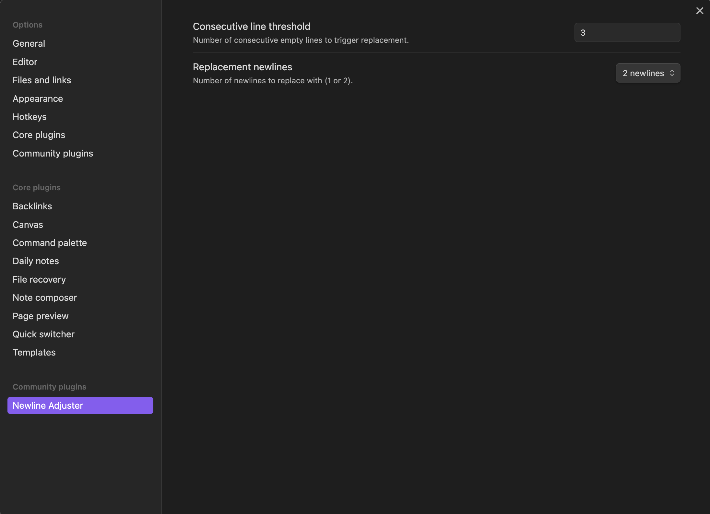

# Newline Adjuster for Obsidian

An Obsidian plugin to replace multiple empty lines with configurable newlines, with preview and undo functionality.

## Features

- **Adjust Multiple Empty Lines**: Automatically replace multiple consecutive empty lines in a document with one or two newlines based on user settings.
- **Preview Changes**: Preview the changes before applying them with a side-by-side comparison of the original and adjusted text.
- **Undo Last Change**: Undo the last change made by the plugin.
- **Configurable Threshold**: Set the number of consecutive empty lines to search for and replace.
- **Configurable Replacement**: Choose whether to replace multiple empty lines with one newline or two newlines.

## Video Demonstration

Watch this video to see the Newline Adjuster plugin in action:
https://www.loom.com/share/5f29a5b93168400ba1476f0b8b88b07a?sid=bb19a67f-21a7-4c8a-a2ac-c7fbca6aca39

## Installation

1. **Download and Build the Plugin**:
    ```bash
    git clone https://github.com/WillLewis/newline-adjuster.git
    cd newline-adjuster
    npm install
    npm run build
    ```

2. **Copy to Your Obsidian Vault**:
    ```bash
    cp -r newline-adjuster /path/to/your/vault/.obsidian/plugins/
    ```

3. **Enable the Plugin**:
    - Open Obsidian.
    - Go to `Settings` > `Community plugins`.
    - Disable `Safe mode` if it is enabled.
    - Find `Newline Adjuster` and enable it.

## Usage

### Ribbon Icons
- Click the **dice** icon in the left sidebar to adjust multiple empty lines in the active document.
- Click the **eye** icon to preview changes before applying them.
- Click the **undo** icon to undo the last change made by the plugin.

### Command Palette
- Open the command palette (Ctrl+P or Cmd+P) and run the following commands:
    - **Adjust Newlines**: Replace multiple empty lines in the active document.
    - **Preview Changes**: Preview the changes before applying them.
    - **Undo Last Change**: Undo the last change made by the plugin.

### Settings

You can adjust the plugin settings to specify the number of consecutive empty lines to search for and replace, and whether to replace with one or two newlines.

1. **Open Settings**:
    - Click on the gear icon (⚙️) in the bottom left corner to open the settings menu.
    - Navigate to `Community plugins` and find `Newline Adjuster`.

2. **Adjust Consecutive Line Threshold**:
    - In the settings tab, find the option `Consecutive Line Threshold`.
    - Enter the number of consecutive empty lines you want the plugin to search for and replace. For example, enter `4` to replace any instance of 4 or more consecutive empty lines with a single empty line.

3. **Set Replacement Newlines**:
    - In the settings tab, find the option `Replace with Two Newlines`.
    - Toggle the switch to choose whether to replace multiple empty lines with two newlines instead of one.

    

## Development

### Building the Plugin
To build the plugin from source, follow these steps:

1. **Install Dependencies**:
    ```bash
    npm install
    ```

2. **Build the Plugin**:
    ```bash
    npm run build
    ```

### Contributing

Contributions are welcome! Please open an issue or submit a pull request with your improvements or bug fixes.

## License

This project is licensed under the MIT License. See the [LICENSE](LICENSE) file for details.

## Author

Will Lewis - willxemail@gmail.com [Webmocha](https://webmocha.com)
